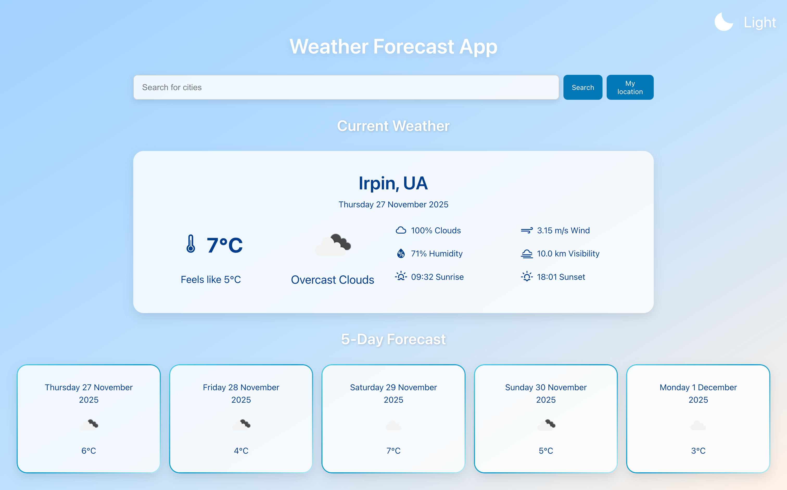

# 🌤️ React Weather App

A simple and elegant Weather App built with React, TypeScript and styled-components. The app allows users to search for weather by city, detect their current location, switch between light/dark themes, and view detailed weather information.

---

## 🚀 Demo

🔗 [Live Demo on Vercel](https://weather-app-chi-nine-32.vercel.app/)

---

## 📸 Preview



---

## ⚙️ Features

## ⚙️ Features

✅ Search weather by typing the city name  
✅ Shows temperature, humidity, wind speed, and "feels like" data  
✅ Saves the last searched city in localStorage  
✅ Uses navigator.geolocation to detect the user's coordinates ✅ Theme toggle built with styled-components  
✅ Custom themes stored using ThemeProvider  
✅ Displays accurate sunrise & sunset time for the selected location  
✅ Responsive UI

---

## 💡 Tech Stack

<div>
  
  
  
  
</div>

---

## 🛠 Installation & Setup

```bash
# Clone the repo
git clone https://github.com/Alozi/weather-app.git

# Move to folder
cd weather-app

# Install dependencies
npm install

# Start the project
npm run dev
```
